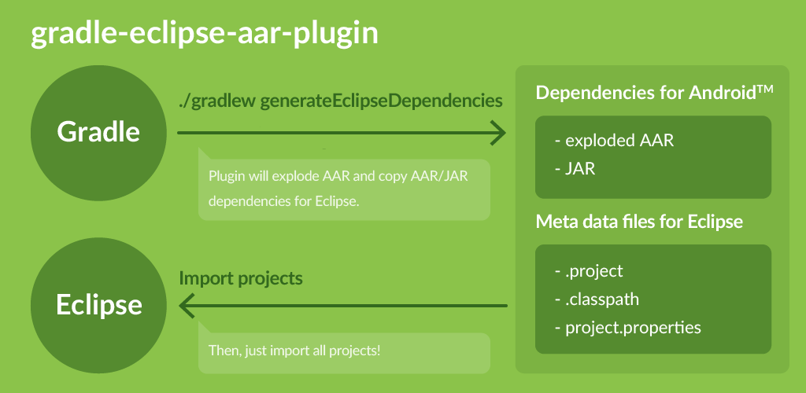

# gradle-eclipse-aar-plugin

[](https://travis-ci.org/ksoichiro/gradle-eclipse-aar-plugin)
[](https://coveralls.io/r/ksoichiro/gradle-eclipse-aar-plugin?branch=master)
[](https://github.com/ksoichiro/gradle-eclipse-aar-plugin/releases/latest)

Gradle plugin to use Android AAR libraries on Eclipse.  
With this plugin, you can manage dependencies with Gradle and build app on Eclipse.

Android Studio has been officially released, but some of you still want/are forced to use Eclipse ADT for some reasons.
Android Studio has much better build system by integrating Gradle, and many of the remarkable features are unavailable in Eclipse.
In particular, many Android libraries are provided with AAR format recently, so it's now big disadvantage for Eclipse to manage these dependencies.
This plugin will explode AAR libraries and create "Android Library Project"s or copy JARs for your project by executing just one command, and you just import these projects in Eclipse.

Originally I was inspired by [this article](http://www.nodeclipse.org/projects/gradle/android/aar-for-Eclipse), then rewrote almost all of it and added many improvements to automate conversion process and to cover several dependency/project conditions.



## Prerequisites

This plugin is tested under these conditions.

* [Eclipse IDE for Java Developers 4.4 (Luna) SR1](https://eclipse.org/downloads/packages/eclipse-ide-java-developers/lunasr1a)
* [Eclipse ADT Plugin](http://developer.android.com/sdk/installing/installing-adt.html)
* Oracle JDK 7

## Usage

### Prepare build.gradle

If your project already uses Gradle and Android Studio,
just apply this plugin and configure it in `eclipseAar` closure.

```groovy
buildscript {
    repositories {
        mavenCentral()
        // Enable this if you use SNAPSHOT
        //maven {
        //    url uri('https://oss.sonatype.org/content/repositories/snapshots/')
        //}
    }
    dependencies {
        classpath 'com.android.tools.build:gradle:1.0.0'
        classpath 'com.github.ksoichiro:gradle-eclipse-aar-plugin:0.1.1'
    }
}

apply plugin: 'com.android.application'

// Apply this plugin
apply plugin: 'com.github.ksoichiro.eclipse.aar'

repositories {
    mavenCentral()
}

// Write your dependencies
dependencies {
    compile 'com.android.support:appcompat-v7:21.0.2'
    compile 'com.nineoldandroids:library:2.4.0'
    compile 'com.melnykov:floatingactionbutton:1.0.7'
    compile 'com.github.ksoichiro:android-observablescrollview:1.5.0'
}

// Configure eclipse-aar plugin
eclipseAar {
    // See "Configurations" for details
    androidTarget = 'android-21'
    aarDependenciesDir = 'aarDependencies'
}

// Configure android plugin
// (Even if you don't develop with Gradle, write following at least)
android {
    compileSdkVersion 1

    // Source directory is 'src/main/java' by default.
    // This will be added as a classpath entry in .classpath file.
    // If you'd like to set src directory other than that,
    // override it with sourceSets.main.java.srcDirs like this.
    sourceSets {
        main {
            java.srcDirs = [ 'src' ]
        }
    }
}
```

### Prepare Gradle or Gradle wrapper

Install Gradle 2.2.1+.

Or copy Gradle wrapper files into your project.
If you use Gradle wrapper, you don't have to install Gradle.

* `gradle`
* `gradlew`
* `gradlew.bat`

### Generate dependencies

```sh
$ ./gradlew generateEclipseDependencies
```

JAR dependencies will be copied to `libs` directory,  
and AAR dependencies will be exploded and copied to `aarDependencies` directory by default.

### Import projects to Eclipse and build app

1. Launch Eclipse.
1. Select `File` > `Import`.
1. Select `General` > `Existing Projects into Workspace` and click `Next`.
1. Click `Browse` and select project root directory.
1. Check `Search for nested projects`.
1. Select all projects and click next.  
   Note that if you've imported projects in Eclipse before, there might be `bin` directories and they might be recognized as projects, but don't select them.
1. Some warning messages might be generated, but ignore them and wait until build finishes.

### Run the app

1. Confirm your device is connected.
1. Right click your main project and select `Run As` > `Android Application`.

### project.properties?

Eclipse ADT plugin uses `project.properties` file to manage library project dependencies.  

If you don't have `project.properties` file, this plugin will create it.  
If you have `project.properties` file but don't have the required AAR dependency entries in it, this plugin will add these entries, too.  
Therefore you don't have to care about them.

But please note that if you have file dependencies (`libs/xxx.jar`),
you should manually add entries for them to `project.properties` file.

### .classpath files?

Eclipse has `.classpath` files to manage dependencies.  
For Android apps, each library projects must be declared as `<classpathentry>` tags in `.classpath` file.

If you don't have `.classpath` file, this plugin will create it.  
If you have `.classpath` file but don't have `<classpathentry>`s for the required libraries in it, this plugin will add these entries, too.  
Therefore you don't have to care about them.

But please note that if you have file dependencies (`libs/xxx.jar`),
you should manually add entries for them to `.classpath` file.

### .project files?

Eclipse has `.project` files to manage project description.  
If you don't have `.project` file, this plugin will create it, so you don't have to care about them.

## Configurations

Configurations for this plugin are written in `eclipseAar` closure.

| Configuration | Default | Description |
| ------------- | ------- | ----------- |
| androidTarget | `android-21` | `target` value in dependency projects' project.properties |
| aarDependenciesDir | `aarDependencies` | Directory to explode AARs |
| jarDependenciesDir | (null) | Directory to locate JAR. |
| projectNamePrefix | (Empty) | Project name prefix for AAR dependencies |
| projectName | (Target project name) | Base project name for AAR dependencies |
| cleanLibsDirectoryEnabled | `false` | Set to `true` if you want `libs` directory to be cleaned before files are generated. |
| targetConfigurations | `['compile', 'debugCompile']` | Configurations that dependency JAR/AAR will be aggregated from |

## Samples

See `samples` directory.

Each projects refer to `samples/repo` directory as a Maven repository.
You must generate it before using samples with following command:

```sh
$ cd /path/to/this/project/root/
$ ./gradlew clean assemble uploadArchives
```

After that, you can try this plugin in each projects.  
Example:

```sh
$ cd ./samples/example/
$ ./gradlew generateEclipseDependencies
```

## License

    Copyright 2015 Soichiro Kashima

    Licensed under the Apache License, Version 2.0 (the "License");
    you may not use this file except in compliance with the License.
    You may obtain a copy of the License at

        http://www.apache.org/licenses/LICENSE-2.0

    Unless required by applicable law or agreed to in writing, software
    distributed under the License is distributed on an "AS IS" BASIS,
    WITHOUT WARRANTIES OR CONDITIONS OF ANY KIND, either express or implied.
    See the License for the specific language governing permissions and
    limitations under the License.

